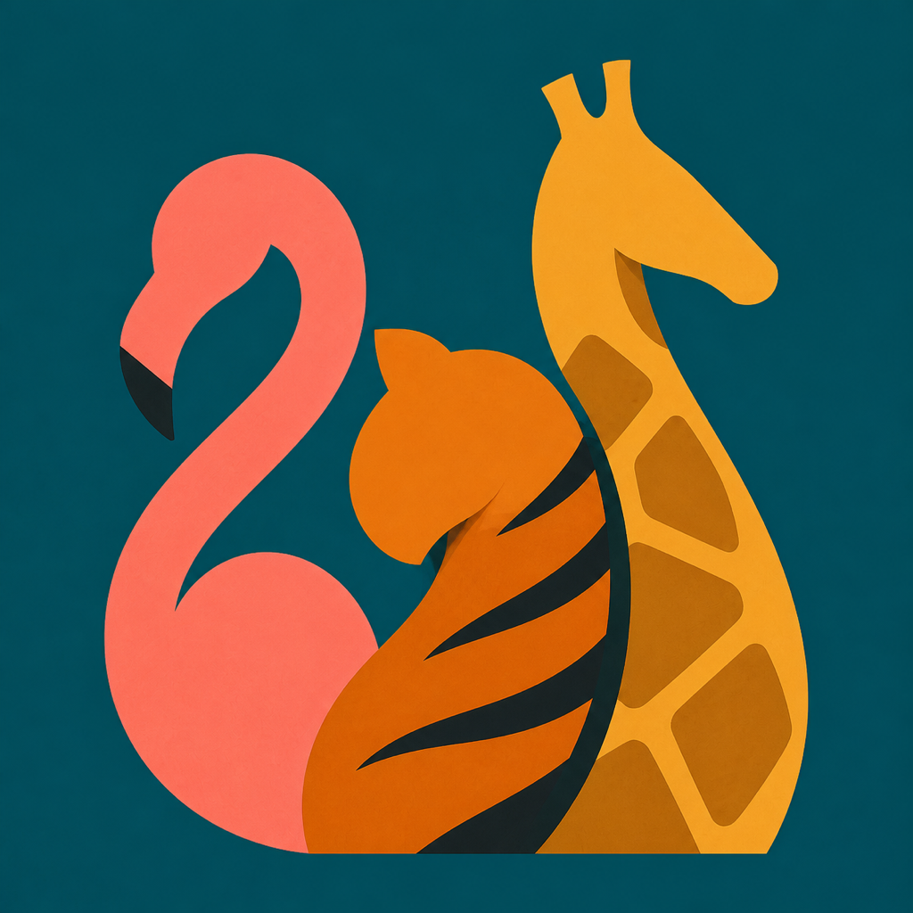

<p align="center">
  
</p>

<h1 align="center">Venery</h1>

<p align="center"><i>A small daily ritual for animal words.</i><br>One animal, one collective noun, every day.</p>

<p align="center">
  <a href="#run-locally"></a>
  <a href="#technical-snapshot"></a>
  <a href="https://github.com/yonaskolb/XcodeGen"></a>
  <a href="#overview"></a>
</p>

Venery is a private, offline-first iOS app for discovering the wonderfully specific names we give groups of animals—from a **flock of birds** to a **crash of rhinos**. It presents one shared animal of the day, lets people browse the full collection and save favourites, and brings the day’s word to the Home Screen and Lock Screen with quiet, native widgets.

Built with SwiftUI, WidgetKit, and a bundled data set. No account, ads, analytics, or server required.

## Overview

The word *venery* refers to the traditional collective nouns used for animals. Venery turns that small corner of language into a lightweight daily experience rather than a reference book to work through all at once.

Every day, the app selects the same animal for everyone worldwide using a deterministic UTC-based schedule. The result is a tiny shared discovery: open the app, glance at a widget, or return to a favourite phrase whenever you like.

## Why This Exists

Animal collective nouns are useful, strange, and often unexpectedly beautiful. They deserve a calmer home than a search result.

Venery is designed around a few simple ideas:

- Make the day’s phrase feel like a small object worth keeping.
- Make the whole collection easy to explore without turning it into a noisy feed.
- Keep personal state private and local to the device.
- Let the phrase live naturally on iOS through Home Screen and Lock Screen widgets.

## Highlights

- **A shared daily animal.** The daily selection changes at midnight UTC and is identical everywhere in the world.
- **A focused daily card.** Emoji, animal, and collective phrase are presented as one simple, readable moment.
- **Browse the collection.** Search and scroll through the complete bundled list of animals and phrases.
- **Favourites.** Save phrases locally and return to them from the home screen.
- **Home Screen widget.** A compact, elegant view of the day’s animal and its collective noun.
- **Lock Screen widget.** A transparent accessory widget made for a quick glance.
- **Offline by design.** The vocabulary data ships in the app; normal use does not need an account or network connection.
- **Private by default.** No advertising SDKs, analytics, tracking, or remotely stored user data.

## Experience Snapshot

Venery has three connected surfaces:

| Surface | Purpose |
| --- | --- |
| **App home** | Presents the day’s animal, the collective phrase, and a direct path to favourites or browsing. |
| **Collection** | Lets people search, explore details, and save any animal phrase. |
| **Widgets** | Keeps today’s phrase on the Home Screen or Lock Screen without needing to open the app. |

The app reloads widget timelines when it opens and schedules the next daily update for the next UTC day.

## Technical Snapshot

- **Platform:** iOS 17+
- **Language:** Swift
- **UI:** SwiftUI
- **Widgets:** WidgetKit
- **State:** Swift Observation and `UserDefaults` for local favourites
- **Project generation:** [XcodeGen](https://github.com/yonaskolb/XcodeGen)
- **Data:** Bundled JSON; no backend or API dependency

## Project Tour

```text
.
├── VeneryApp/
│   ├── Models/
│   │   ├── AnimalEntry.swift       Daily selection and bundled-data loading
│   │   └── FavoritesStore.swift    Local persisted favourites
│   ├── Resources/
│   │   ├── Assets.xcassets/        App icon and colour assets
│   │   └── list-of-animal-venery.json
│   ├── Views/                      App home, browse, detail, and About screens
│   └── VeneryApp.swift             App entry point and widget refresh hook
├── VeneryWidget/
│   ├── Resources/                  Widget copy of the bundled vocabulary data
│   ├── Info.plist
│   └── VeneryWidget.swift          Home Screen and Lock Screen widget views
├── ATTRIBUTIONS.md                 Source and CC BY-SA attribution notice
├── project.yml                     Canonical XcodeGen project definition
└── Venery.xcodeproj/               Generated Xcode project
```

### Key Decisions

#### One daily selection, everywhere

`DailyPicker` uses a deterministic shuffle seeded by the UTC year, then indexes into that sequence by the UTC day of year. That means the schedule feels shuffled, remains stable for the year, and does not depend on a server, locale, or the user’s device time zone.

#### Favourites stay on-device

Saved animal identifiers are stored in `UserDefaults`. There is no account system, sync service, or user database.

#### Widgets are extensions, not standalone apps

`VeneryWidget` is embedded in the Venery app. Run the **Venery** scheme; add the widget from iOS’s Home Screen or Lock Screen widget gallery.

## Run Locally

### Requirements

- macOS with Xcode
- iOS 17+ Simulator or device
- [XcodeGen](https://github.com/yonaskolb/XcodeGen) only when changing `project.yml`

### Open and run

1. Open `Venery.xcodeproj` in Xcode.
2. Choose the **Venery** scheme—not `VeneryWidget`.
3. Select an iPhone Simulator or a signed physical device.
4. Press Run.

The widget is installed with the app. To see it, long-press the Home Screen or Lock Screen, add a widget, and select **Venery** from the widget gallery.

### Regenerate the project

`project.yml` is the source of truth for the Xcode project. After changing targets, build settings, resources, or schemes, regenerate the project:

```bash
xcodegen generate
```

Then reopen `Venery.xcodeproj`. Avoid making structural edits only in Xcode’s project editor, since regeneration can replace them.

## Privacy

Venery does not collect personal data.

- No accounts or sign-in
- No analytics or advertising SDKs
- No tracking across apps or websites
- No remote database or app server
- Favourites and preferences remain on the user’s device

See the published privacy policy for the user-facing statement.

## Data, Attribution, and License Notice

The bundled animal list is adapted from [cjwinchester/collective-nouns-for-animals](https://github.com/cjwinchester/collective-nouns-for-animals), which identifies Wikipedia’s [List of English terms of venery, by animal](https://en.wikipedia.org/wiki/List_of_English_terms_of_venery,_by_animal) as its source.

The adapted material is available under [CC BY-SA 4.0](https://creativecommons.org/licenses/by-sa/4.0/). Venery formats, selects, and presents that material as a daily vocabulary experience; it includes attribution, a license link, and a notice of modification in the app’s About screen. See [ATTRIBUTIONS.md](ATTRIBUTIONS.md) for the full notice.

## Contributing

This is a small, intentional app. If you change the vocabulary data, daily-selection rules, widget layout, or attribution text, please check all of the following before opening a pull request:

- The app and widget each include the data resource they need.
- The daily phrase stays identical across time zones for the same UTC day.
- The compact Home Screen and Lock Screen widgets remain readable.
- Favourites still persist after relaunching.
- Attribution and license obligations remain accurate for any data changes.
- `project.yml` and the generated Xcode project stay in sync.

## About

Venery is a quiet iOS reference app for people who like language, animals, and the pleasure of a good strange word.
